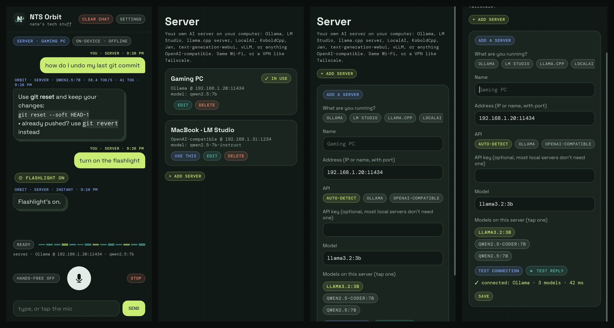

# NTS Orbit

An AI assistant for Android that runs **on your phone** or talks to **your own AI server**. No accounts, no cloud, no tracking. Made by **Nate's Tech Stuff**.

[](LICENSE) [](https://discord.gg/kGDcJShcFZ)

**Free to download and use. Source-available:** the code is here to read for reference, but it isn't open source. Copying, modifying or redistributing it isn't allowed without permission (see [License](#license)).



> **Heads up: NTS Orbit is in development.** Things will change and there are bugs. Issues and ideas are welcome.

## Features

- **On-device chat.** Load a `.gguf` model and it runs fully offline on the phone (llama.cpp, arm64), streamed and read out loud sentence by sentence.
- **Server mode.** Chat with an AI server you run on your computer:
  - **Ollama** (native API, default port 11434)
  - **LM Studio** (:1234), **llama.cpp server** (:8080), **LocalAI**, **KoboldCpp**, **Jan**, **text-generation-webui**, **vLLM**, or anything **OpenAI-compatible** (`/v1/models` + `/v1/chat/completions`)
  - auto-detect, optional API key, model picker, test-connection button, several saved servers
  - same Wi-Fi, or over a VPN like Tailscale (plain `http://` to the address you type in is allowed)
- **Voice.** Tap the mic or go hands-free. Speech-to-text and the voice use your phone's own engines.
- **Phone actions.** "turn on the flashlight", "set a timer for 5 minutes", "set an alarm for 7am", "open YouTube", time/date, battery. Simple commands run instantly; the on-device model can also call these as tools.
- Quick Settings tile and a home-screen widget for one-tap talk.

What it does **not** do: no texting, no SMS, no reading notifications or contacts. The only network connections it makes are to servers you add yourself.

## Install

**NTS Orbit is free.** It's Android only: an iPhone/iOS version unfortunately isn't possible.

**Coming soon to Google Play.** Until then, you can install the APK directly:

1. Go to **[Releases](../../releases)** and download the APK (`NTS-ORBIT-PUBLIC-1.0.0.apk`) on your phone.
2. Open it and allow "install unknown apps" for your browser/files app when Android asks.
3. Needs Android 8.0+ on a **64-bit ARM** phone (almost every phone from the last few years).

Package name: `com.natestechstuff.orbit`.

## Get the model

For on-device mode you need a GGUF model file:

1. Download the NTS Orbit model, `NTS-ORBIT-PUBLIC.gguf`, from the same **[Release](../../releases)** (about 1 GB, use Wi-Fi).
2. In the app: **Settings → on-device model → pick .gguf file**, choose the download, then tap **▶ test**.

Any other small chat GGUF works too (for example a Qwen2.5 1.5B/3B Instruct `Q4_K_M`). Bigger models need more RAM: 1.5B runs well on most phones with 6 GB+.

Prefer your computer's GPU? Skip the download, run Ollama or LM Studio on your PC, and add it under **Server**.

See [The model: how it was trained](#the-model-how-it-was-trained) for what's inside it.

## The model: how it was trained

The NTS Orbit model is a fine-tune of **[Qwen2.5-Coder-1.5B-Instruct](https://huggingface.co/Qwen/Qwen2.5-Coder-1.5B-Instruct)** (Apache-2.0). It was trained with **QLoRA** (the base model loaded in 4-bit, LoRA rank 16) on a free **Kaggle T4 GPU**, in two rounds:

| | Round 1 | Round 2 (the public model) |
|---|---|---|
| Started from | Qwen2.5-Coder-1.5B-Instruct | the round 1 adapter |
| Training data | ~6,100 conversations | ~2,760 conversations (~1.27M tokens) |
| Epochs / learning rate | 2 / 2e-4 | 1 / 1e-4 |

**Round 1** taught the basics: ~580 hand-written examples (a short, casual voice-friendly style, Linux and coding help, defensive security, AI/ML) mixed with filtered conversations from public datasets: [glaive-code-assistant](https://huggingface.co/datasets/glaiveai/glaive-code-assistant) and [oasst2](https://huggingface.co/datasets/OpenAssistant/oasst2) (Apache-2.0) and [self-oss-instruct-sc2](https://huggingface.co/datasets/bigcode/self-oss-instruct-sc2-exec-filter-50k) (ODC-By 1.0).

**Round 2** made the public edition. It added **354 new defensive-security and CTF examples** (including refusals for things like breaking into accounts or systems you don't own), **328 multi-turn chat examples** so it handles back-and-forth better, **41 examples about the public edition itself**, and **548 tool-calling examples** for phone actions (timer, alarm, flashlight, open app, time, battery) using Qwen's native `<tool_call>` format. About 1,500 older examples were replayed so it didn't forget round 1. The public data in this round is Apache-2.0 only (glaive-code-assistant and oasst2).

The checkpoint with the best validation loss is the one kept (losses logged during the run: train about 0.73, validation about 0.86). It was then merged into the base model and converted with llama.cpp to **GGUF Q4_K_M** (about 1 GB). On a mid-range phone (Moto g power 5G, 2024) it runs at about **5–6 tokens/second, fully offline**.

The training notebooks and data aren't published here.

**Safety:** the model's safety training is **best-effort, not a guarantee**. Small models can still be wrong, make things up, or answer things they shouldn't. Double-check anything important. The base model, Qwen2.5-Coder-1.5B-Instruct, is Apache-2.0; the fine-tuned NTS Orbit model is under the NTS Orbit License (see [THIRD_PARTY_NOTICES.md](THIRD_PARTY_NOTICES.md)).

## Build it yourself

The license lets you build an **unmodified** copy for your own personal use. Sharing builds or modified versions isn't allowed without permission.

You need JDK 17, the Android SDK (platform 34) and **NDK 27.2.12479018** + CMake 3.22.1 (install both from Android Studio's SDK Manager).

```bash
git clone https://github.com/natestechstuff/nts-orbit.git
cd nts-orbit
echo "sdk.dir=$HOME/Android/Sdk" > local.properties    # your SDK path
./gradlew assembleRelease
# -> app/build/outputs/apk/release/app-release.apk
```

llama.cpp is downloaded automatically at the pinned commit the app was tested with. To use a local checkout instead: `./gradlew assembleRelease -PllamaCppDir=/path/to/llama.cpp`.

`assembleRelease` signs with your local Android **debug key** so the APK installs straight away. An APK you build has a different signature from the official release, so uninstall one before installing the other. For a real store release, set up your own release keystore (and never commit it).

### Tests

```bash
./gradlew testDebugUnitTest
# stream a real reply from a local Ollama too:
./gradlew testDebugUnitTest -PrealServer=http://127.0.0.1:11434 -PrealModel=qwen2.5:0.5b
# render the screens to PNGs (Robolectric):
./gradlew testDebugUnitTest -Pscreenshots=/tmp/shots
```

### Project layout

```
app/src/main/java/…   the app (plain Android framework, no libraries)
  ServerClient         Ollama + OpenAI-compatible streaming client
  ServerStore          saved servers
  LocalBrain, LlamaBridge   on-device model (JNI → llama.cpp)
  ActionRouter, ToolCalls, ToolDispatcher, PhoneTools   phone actions / tool calling
app/src/main/cpp/     JNI glue for llama.cpp
app/src/test/         unit tests (JUnit + Robolectric, mock HTTP servers)
```

The Java package is `com.natestechstuff.jarvis` (the project's original codename); the app id is `com.natestechstuff.orbit`.

## Support

NTS Orbit is free. If it's useful to you, you can support development here:

[](https://buymeacoffee.com/natestechstuff)

## Community

Join the **Orbit Official Discord** for downloads, help, bug reports and early updates: **[discord.gg/kGDcJShcFZ](https://discord.gg/kGDcJShcFZ)**

## Contact

Made by **Nate's Tech Stuff**: [natestechstuff.com](https://natestechstuff.com) · [info@natestechstuff.com](mailto:info@natestechstuff.com)

## License

NTS Orbit is **source-available** under the **[NTS Orbit License](LICENSE)**. Copyright © 2026 Nate's Tech Stuff. All rights not granted are reserved.

- ✅ Free to download, install and use the app and the model for personal use
- ✅ Read the source for reference, and build an unmodified copy for yourself
- ❌ No copying, modifying, redistributing, sublicensing or reselling without written permission

Want to do something the license doesn't allow? Ask at [info@natestechstuff.com](mailto:info@natestechstuff.com).

Version 1.0.0 was first published under GPL-3.0; copies obtained under GPL-3.0 before the change keep those rights.

Third-party parts keep their own licenses: see [THIRD_PARTY_NOTICES.md](THIRD_PARTY_NOTICES.md) (llama.cpp/ggml: MIT, fonts: SIL OFL 1.1, Qwen2.5-Coder base model: Apache-2.0, Gradle wrapper: Apache-2.0).
